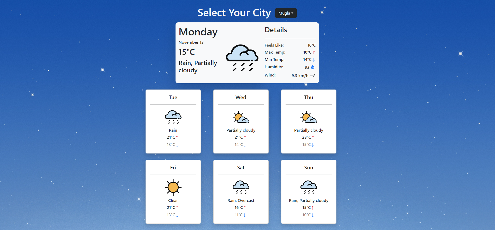

# React Weather App
----

>This weather application provides you with the current weather conditions as well as the details about the weather within the next 7 days. (Context Api Practiced.)

## Available Scripts

In the project directory, you can run:

### `npm install`
### `npm run dev`

Runs the app in the development mode.\
Open [http://localhost:3000](http://localhost:3000) to view it in your browser.

## Useful Links

* [API](https://www.visualcrossing.com)
* [Icons](https://github.com/visualcrossing/WeatherIcons)
* [React Icons](https://react-icons.github.io/react-icons)
 

